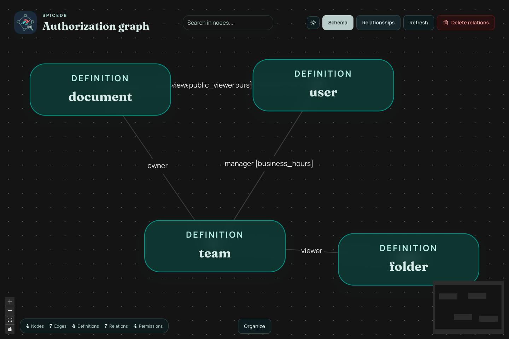
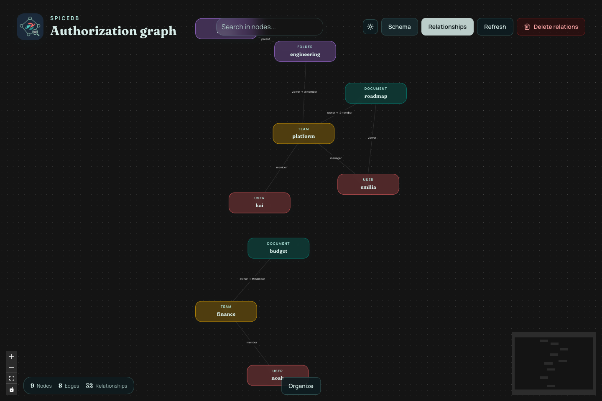
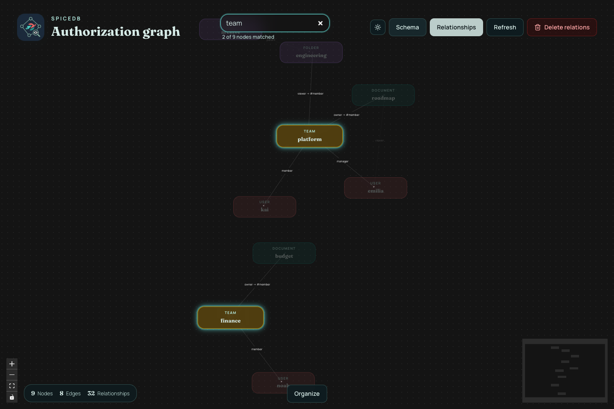

# SpiceDB Viewer

<p align="center">
  
</p>

<p align="center">
  
  
  
  
  
  
</p>

A TanStack Start app for inspecting and managing a SpiceDB schema and relationship graph.

## Screenshots

### Schema graph



### Relationship graph



### Node search



## Features

- Visualize reflected SpiceDB definitions, relations, permissions, caveats, and dependencies.
- Switch to a concrete relationship graph exported from SpiceDB.
- Search nodes, inspect metadata, refresh the graph, and delete individual or bulk relationships.
- Connect through gRPC or REST with secure and local-insecure modes.

## Run

```bash
bun install
bun run dev
```

Open `http://localhost:3010`.

## Required environment

```bash
SPICEDB_ENDPOINT=localhost:50051
SPICEDB_TOKEN=your-token
SPICEDB_PROTOCOL=grpc # or rest
SPICEDB_SECURITY=insecure-localhost # or secure
SPICEDB_RELATIONSHIP_EXPORT_LIMIT=1000
```

## Commands

```bash
bun run check
bun run test
bun run build
```
